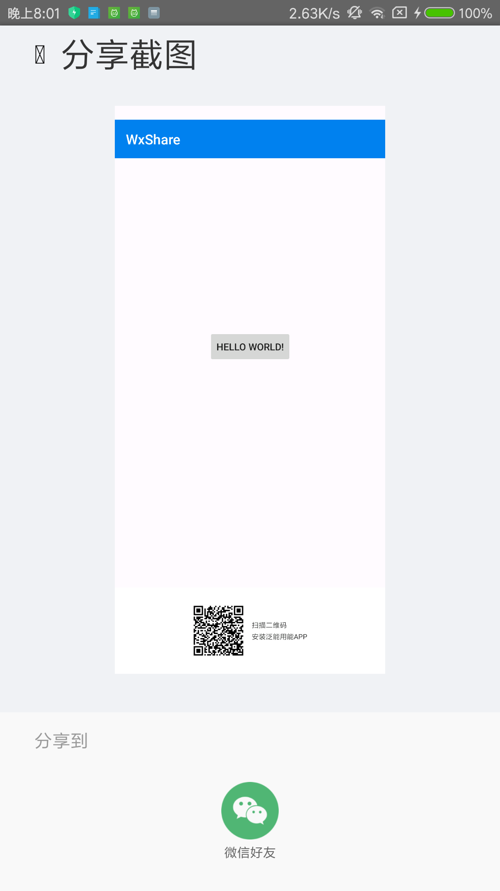
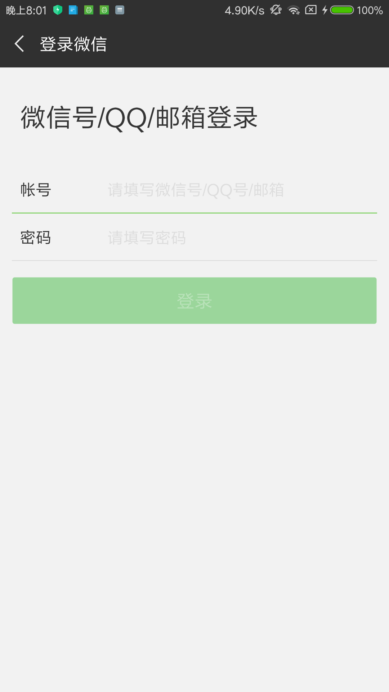
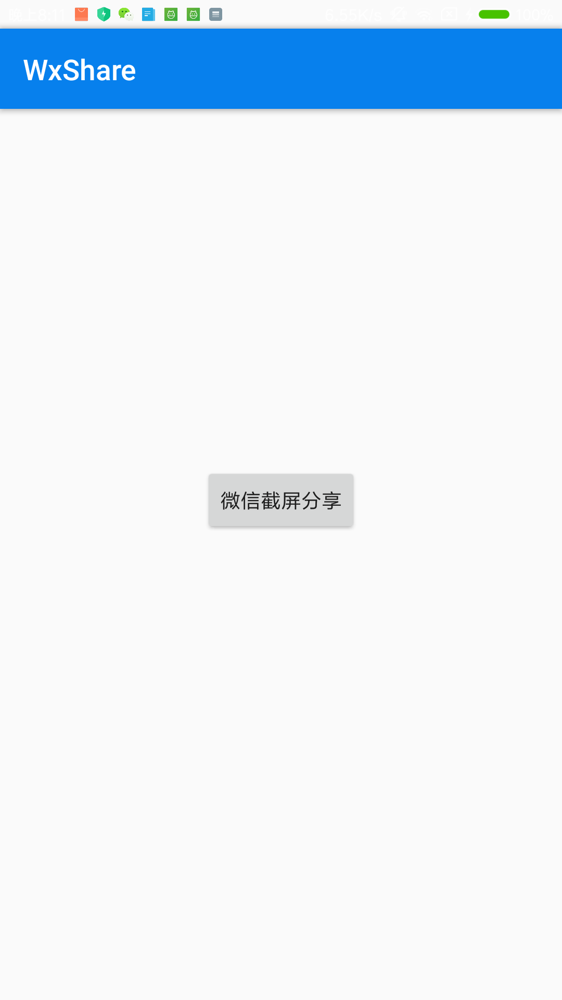

# Android-RecyclerCalendarView

仿 猫眼专业版 日历 view.

#### 添加依赖和配置

* 工程添加依赖仓库，Add the JitPack repository to your build file

```Java
allprojects {
   repositories {
   		...
   	    maven { url 'https://jitpack.io' }
   }
}
```

* APP目录build.gradle文件添加如下配置：

```Java
dependencies {
   implementation 'com.github.liujianguangnice:Wxshare:1.0.1'
}
```

#### 2、效果展示






<!--

-->


#### 3、核心代码

```Java
 public View getFakeTitle(String title,Boolean isHaveBack,Boolean isHaveFilter,Boolean isHaveShare){
        DisplayMetrics metric = new DisplayMetrics();
        getThisActivity().getWindowManager().getDefaultDisplay().getMetrics(metric);
        int width = metric.widthPixels;
        int height = DensityUtil.dip2px(this,44);
        View view = LayoutInflater.from(getThisActivity()).inflate(R.layout.head_base_dialog, null, false);
        //去到指定view大小的函数
        layoutView(view, width, height);
        TextView tv_left_btn = view.findViewById(R.id.tv_left_btn);
        if(isHaveBack){
            tv_left_btn.setVisibility(View.VISIBLE);
        }else{
            tv_left_btn.setVisibility(View.INVISIBLE);
        }
        ImageView iv_right_img_filter = view.findViewById(R.id.iv_right_img_filter);
        if(isHaveFilter){
            iv_right_img_filter.setVisibility(View.VISIBLE);
        }else{
            iv_right_img_filter.setVisibility(View.INVISIBLE);
        }
        ImageView iv_right_img = view.findViewById(R.id.iv_right_img);
        if(isHaveShare){
            iv_right_img.setVisibility(View.VISIBLE);
        }else{
            iv_right_img.setVisibility(View.INVISIBLE);
        }

        TextView titleTv = view.findViewById(R.id.tv_middle_title);
        titleTv.setText(title);
        return view;
    }

    public void openShareDialog(Bitmap bitmap) {
        DisplayMetrics metric = new DisplayMetrics();
        getThisActivity().getWindowManager().getDefaultDisplay().getMetrics(metric);
        int width = metric.widthPixels;
        int height = metric.heightPixels;
        View view = LayoutInflater.from(getThisActivity()).inflate(R.layout.share_dialog_bottom, null, false);
        //去到指定view大小的函数
        layoutView(view, width, height);
        final Bitmap boss = ImgTransUtil.addBitmap(bitmap, ImgTransUtil.getViewBitmap(view));


        shareDialog = new ShareDialog(getThisActivity(), boss);
        shareDialog.show();
        shareDialog.setOnDialogListener(new ShareDialog.OnShareDialogListener() {
            @Override
            public void onTrue() {
                Log.i("TAG", "onTrue: ");
                wxShare.sharePicture(boss);
            }

            @Override
            public void onCopy() {

            }

            @Override
            public void onCancel() {
                Log.i("TAG", "onCancel: ");
                shareDialog.dismiss();
            }
        });
    }
    /**
     * View和其内部的子View都具有了实际大小，也就是完成了布局，
     * 相当与添加到了界面上。接着就可以创建位图并在上面绘制了：
     */
    public void layoutView(View v, int width, int height) {
        // 指定整个View的大小 参数是左上角 和右下角的坐标
        v.layout(0, 0, width, height);
        int measuredWidth = View.MeasureSpec.makeMeasureSpec(width, View.MeasureSpec.EXACTLY);
        int measuredHeight = View.MeasureSpec.makeMeasureSpec(height, View.MeasureSpec.AT_MOST);
        /** 当然，measure完后，并不会实际改变View的尺寸，需要调用View.layout方法去进行布局。
         * 按示例调用layout函数后，View的大小将会变成你想要设置成的大小。
         */
        v.measure(measuredWidth, measuredHeight);
        v.layout(0, 0, v.getMeasuredWidth(), v.getMeasuredHeight());
    }
    public void shareOrCopy() {
        Bitmap bitmap = ImgTransUtil.getViewBitmap(getWindow().getDecorView());
        openShareDialog(bitmap);
    }
    public void shareOrCopy(View contentView) {
        Bitmap bitmap = ImgTransUtil.getViewBitmap(contentView);
        openShareDialog(bitmap);
    }

    public void shareOrCopy(View headView ,ViewGroup middleView ) {
        Bitmap bitmap = ImgTransUtil.addBitmap(ImgTransUtil.getViewBitmap(headView),  ImgTransUtil.getViewGroupBitmap(middleView));
        openShareDialog(bitmap);
    }
    public void shareOrCopy(View headView ,View titleView ,ViewGroup middleView ) {
        Bitmap headViewAll = ImgTransUtil.addBitmap(ImgTransUtil.getViewBitmap(headView),  ImgTransUtil.getViewBitmap(titleView));
        Bitmap bitmap = ImgTransUtil.addBitmap(headViewAll,  ImgTransUtil.getViewGroupBitmap(middleView));
        openShareDialog(bitmap);
    }

```

